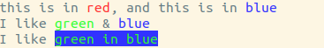
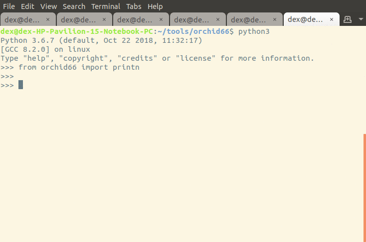

# Orchid66: print colorful stuff nicely


**yeah just, print colorful stuff nicely**

*Note: currently only supports linux*

## example:

```python
from orchid66 import printn

printn("this is in *red*, and this is in *blue*", ('red', 'blue'))
printn("I like *green* && *blue*", ('green', 'blue'))

green_in_blue = ('green', 'blue')

# notice tuple in tuple in second parameter
printn("I like *green in blue*", (green_in_blue,))

# with tuples
red =  (255, 0, 0)
blue = (50, 50, 255)
green = (50, 255, 50)
printn('this word is in *red*, and this is in *blue*', (red, blue))

```


## example gif:


## installation

### through pypi

`pip install orchid66`

### by cloning the repository
1. clone this repository
2. change the current directory into this repository
3. execute `pip install .`

### supported colors
all X11 colors in https://web.archive.org/web/20080502201401/http://cvsweb.xfree86.org/cvsweb/*checkout*/xc/programs/rgb/rgb.txt?rev=1.1

## orchid66s' mini language
text between `*` is rendered as colored, except when preceded by a `&`

`&*` refers to a single `*` that is rendered

`&&` refers to a single `&` that is rendered
