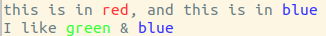

# Orchid66: print colorful stuff nicely
yeah just, print colorful stuff nicely

Note: currently only supports linux

## installation

1. clone this repository
2. change the current directory into this repository
3. execute `pip install .`

## example:
```
from orchid66 import printn

printn("this is in *red*, and this is in *blue*", ('red', 'blue'))
printn("I like *green* && *blue*", ('green', 'blue'))

green_in_blue = ('green', 'blue')

# notice tuple in tuple in second parameter
printn("I like *green in blue*", (green_in_blue,))
```


## example gif:


## orchid66s' mini language

`&*` refers to a single `*` that is rendered

`&&` refers to a single `&` that is rendered
